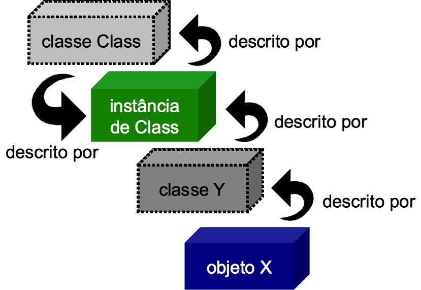

# Reflection Api

A classe principal que é o ponto de partida para obtermos informações sobre os elementos de um programa 
é a classe java.lang.Class que representa justamente uma classe. Sendo assim, o primeiro passo para começar
a trabalhar com reflexão é obtermos a instância de Class da classe que queremos trabalhar com ela.
 
 
**A instância da classe Class possui todas as informações de uma classe. Essa instância possui as metainformações, 
não do objeto, mas da classe.**



### Formas de obter instâncias de Class

- Referências Estáticas;      
- Recuperando a classe de um objeto;
- Uma String com o nome da classe;

Exemplo usando Referências Estáticas:

```java    
    Class<String> classe = String.class;
    System.out.println(classe.getName());
```

Exemplo recuperando a classe de um objeto:

```java    
   Number object = new Integer(100);
   Class<? extends Number> c = object.getClass();
```

Exemplo usando String com o nome da classe:

```java    
   Class<?> classe = Class.forName("br.com.teste.Classe");
```
    
***Dica: Apesar de tipos primitivos em Java não serem considerados classes, é possível
obter uma representação de Class para eles. Para isso, a referência estática des-
ses tipos pode ser utilizada, como por exemplo int.class e char.class . Até
mesmo o void possui uma representação de Class, sendo obtido através da expressão void.class.***


### Quando criar objetos utilizando reflexão?

A criação de objetos utilizado reflexão é indicada quando não se co-
nhece em tempo de compilação a classe que vai ser instanciada. No caso
de haverem diversas implementações para uma classe, mas todas serem
conhecidas, um padrão de criação, como Factory Method ou Builder,
pode ser utilizado para determinar a classe que será criada. A criação de
objetos através de reflexão é indicada quando se deseja que novas clas-
ses possam ser criadas e configuradas como plugins de um software ou
framework existente.

-------------------------------------------------------------------------------------------

### Cuidado com os tipos primitivos!

Os tipos primitivos são uma grande pedra no sapado de quem traba-
lha com reflexão. Apesar do seu tipo ser representado pela classe Class ,
muitas vezes é preciso fazer a distinção dos tipos primitivos e tratá-los
como casos especiais. O exemplo da busca de construtores é um caso
em que os tipos primitivos precisariam ser tratados separadamente, tro-
cando seu tipo pelo de uma classe wrapper ou utilizando um condicional
para cada tipo primitivo. Sendo assim, não se incomode ao ter que criar
uma séria de condicionais para tratar de forma especial cada um dos ti-
pos primitivos, pois nos frameworks que desenvolvi precisei fazer isso
algumas vezes.

------------------------------------------------------------------------------------

### Quando executar métodos por reflexão ?

A orientação a objetos provê meios de você invocar métodos em um
objeto que você não conhece previamente. Isso pode ser feito definindo
uma abstração, como uma interface ou uma classe, que possua essa mé-
todo e utilizando o polimorfismo para invocar esse método em qualquer
objeto que obedeça a essa abstração. Nesses casos, quando é possível ter
uma abstração que representa o método que deve ser invocado, a reflexão
não precisa ser utilizada. Por outro lado, se você precisa lidar com clas-
ses que possuem métodos diferentes e não faz sentido compartilharem
uma mesma abstração, essa é a deixa para a invocação desses métodos
por reflexão. Um bom exemplo desse caso são os Java Beans, que pos-
suem diversos métodos getter e setter diferentes e não é possível criar
uma interface comum que capture essa característica.

------------------------------------------------------------------------------------

